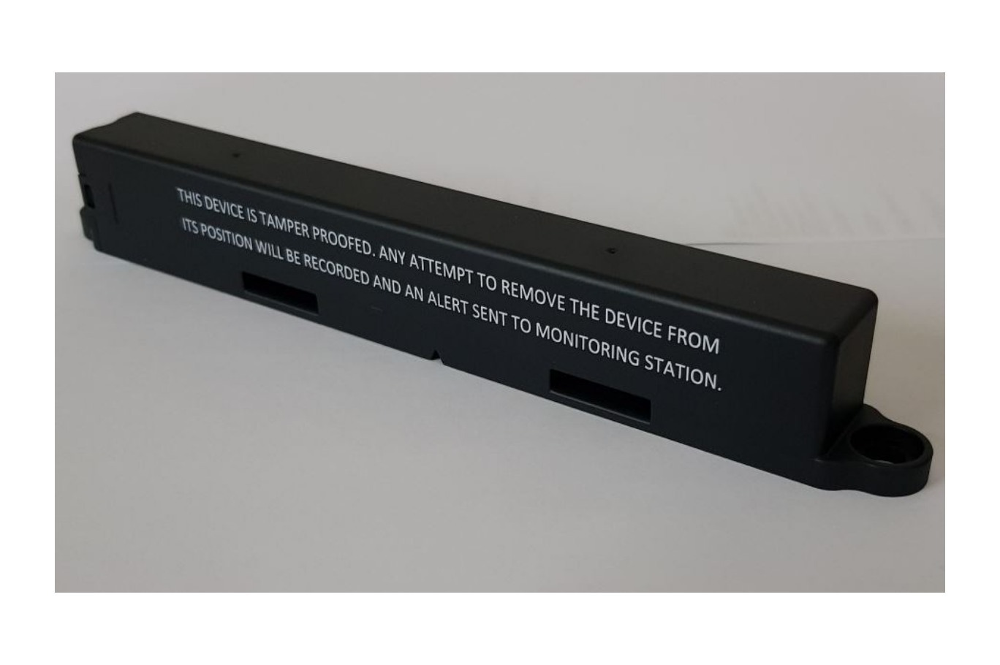

# Introduction

IET10MO (Monarch) is a stick-shaped device, which makes easier to install on carrier by using 2 slits. It is strong made for tough environments by getting the rates of IP68. You could get the data of tracking with a higher accuracy and good performance of 13.99dBm EiRP. Our device’s average time of Cold Start Time is 30 seconds and 2 seconds for Hot Start Time. Tracking indoor location isn’t a problem by using WiFi for geo-location service. We are fully experienced on customizing the firmware of the device. Therefore, if a user needs a specific working scenario, then we can operate it easily by low power consumption and long life time algorithm. In addition, the battery is replaceable.

# Product casing

- Dimensions (in mm): 197 x 20 x 27
- Weight: 95g
- IP Code: IP68
- Recommended operating temperature: -30° to 60° C
- Customizable casing: Yes
- Customizable fixation: Yes
- Minimum order quantity for custom casing or fixation: 200000 products

# Device manual
 - [IET10MO manual](Document/Manual/IET10MO_Manual_V1_7_230109.pdf)

# Android APP
 - [IET10 APP](APP/app-t10-DeepSleep.apk)

# Video Guide
 - [How to wakeup T10 device](https://youtu.be/c4ZIfsw5Sbc)
 - [IET10 Software update via FOTA](https://youtu.be/VrODB4L6qRI)
 - [How to install T10 APP](https://youtu.be/ozPBaetLIXw)
 - [How to use T10 APP](https://youtu.be/4y1o_CUOvuA)